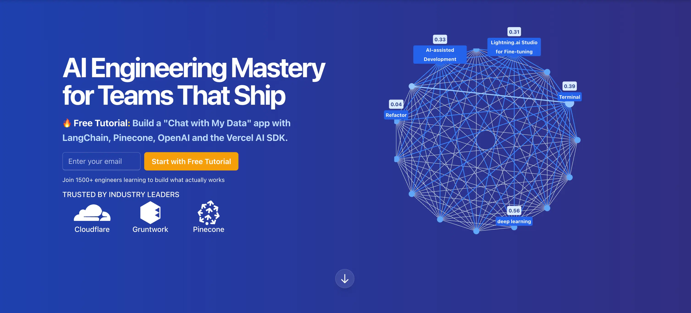

  

<h1 align="center">AI Engineering Mastery for Developers Who Ship🚀</h1>

  I help professional devs and companies build production‑grade AI features with <strong>Next.js 15, the [Vercel AI SDK](https://zackproser.com/blog/vercel-ai-sdk), vector databases, Infrastructure as Code and cloud platforms like AWS and Vercel</strong> 
  <em>Grab the free 7‑day email series + starter repo below.</em>

  
  &nbsp;
  

---

### About Me

- **Staff Developer**
- **Dev Educator @ WorkOS** · 13 yrs shipping SaaS & infra
- Built: Systems at Cloudflare, Infra and DevOps at Gruntwork, ML, Publications, Next.js and AWS infra at Pinecone
- [Publish like crazy](https://zackproser.com/publications)
- Writing & video tutorials seen by 7000+ developers per month 

### Trusted By

  
  
  

### Content Streams

| Platform | Focus |
|----------|-------|
| 📝 [Blog](https://zackproser.com/blog) | deep dives & tutorials |
| 🧵 [Twitter/X](https://twitter.com/zackproser) | daily AI dev threads |
| 🔗 [LinkedIn](https://www.linkedin.com/in/zackproser/) | long‑form breakdowns & case studies |
| 🎥 [YouTube](https://youtube.com/@zackproser) | screencast courses |
| 💬 [Chat](https://zackproser.com/chat) | interactive AI chat experience |
| 🧵 [Threads](https://www.threads.net/@zackproser) | AI dev updates & threads |
| 🌤️ [Bluesky](https://bsky.app/profile/zackproser.bsky.social) | AI dev posts |

---

### Premium Tutorials

- [RAG Pipeline Tutorial (Premium)](https://zackproser.com/products/rag-pipeline-tutorial)
- [Vibe Coding Mastery (Premium)](https://zackproser.com/products/vibe-coding-mastery)
- [Vibe Coding Guide (Free)](https://zackproser.com/blog/vibe-coding-guide)

---

### More

- [Testimonials](https://zackproser.com/testimonials)
- [Services](https://zackproser.com/services)
- [Products](https://zackproser.com/products)