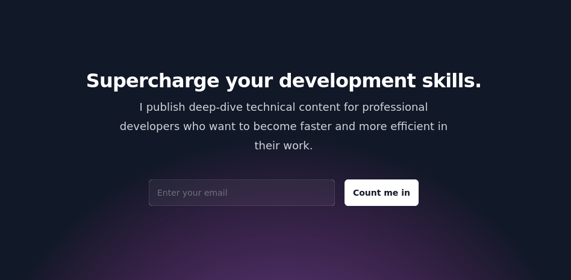

# Howdy :wave:

I'm a senior software engineer at [Gruntwork](https://github.com/gruntwork-io). Previously: [Cloudflare](https://cloudflare.com), [Cloudmark](https://cloudmark.com) and [BrightContext](https://www.crunchbase.com/organization/brightcontext).

[Join me on wren.co to support projects addressing climate change](https://www.wren.co/join/ZackProser?utm_campaign=share&utm_medium=profile_referral_link):

:book: [Tutorial: How I built a serverless app that auto-rotates this badge ^](https://link.medium.com/M1dB6y4Nzeb)

## Interests

Golang, Javascript, Infrastructure as code, AWS and distributed systems. Drawing, painting, and reading.

## Links

<table>
<thead>
  <tr>
    <th>:clapper: Video :movie_camera:</th>
    <th>:notebook_with_decorative_cover: Writing :books:</th>
    <th>:octocat: Portfolio :computer:</th>
    <th>:camera: Art :art:</th>
    <th>:lock: Contact :link:</th>
  </tr>
</thead>
<tbody>
  <tr>
<td>
   <ul>
        <li><a href="https://twitch.tv/zackproser">Twitch</a></li>
        <li><a href="https://youtube.com/@zackproser">YouTube</a></li>
      </ul>
    </td>
    <td>
      <ul>
        <li><a href="https://zackproser.com/blog">Blog</a></li>
        <li><a href="https://medium.com/@zackproser">Medium</a></li>
      </ul>
    </td>
    <td>
      <ul>
        <li><a href="https://zackproser.com">Portfolio</a></li>
        <li><a href="https://codepen.io/zackproser/pen/MVvRgW">Codepen</a></li>
      </ul>    
    </td>
    <td> 
      <ul>
        <li><a href="https://instagram.com/zackproser">Instagram</a></li>
        <li><a href="https://art.zackproser.com">Prints</li>
      </ul>
   </td>
    <td>
     <ul> 
       <li><a href="https://keybase.io/zackproser">Keybase</a></li>
       <li><a href="https://linkedin.com/in/zackproser/">LinkedIn</a></li>
      </ul>
    </td>
  </tr>
</tbody>
</table>

## Certifications

<table>
<thead>
  <tr>
    <th> AWS SysOps Admin Associate </th>
    <th> AWS Developer Associate </th>
    <th> AWS Solutions Architect Associate </th>
    <th> Hashicorp Terraform Associate </th>
    <th> AWS Cloud Practitioner </th>
  </tr>
</thead>
<tbody>
  <tr>
    <td>
        
    </td>
    <td>
         
    </td>
    <td>
        
    </td>
    <td>
        
    </td>
    <td> 
        
   </td>
  </tr>
</tbody>
</table>
